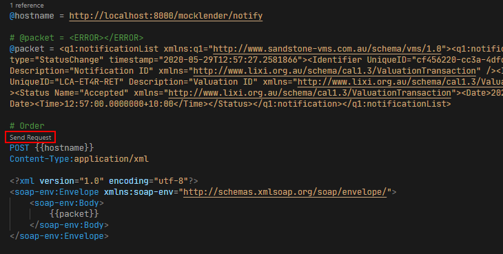

# Description

This is a collection of mock services for lixi, lendfast, hometrack and property images on a [django web framework](https://www.djangoproject.com/) with rest and soap services using [spyne](http://spyne.io/#inprot=HttpRpc&outprot=JsonDocument&s=rpc&tpt=WsgiApplication&validator=true).

# Setup

You will need at least [Python version 3.7](https://www.python.org/downloads/release/python-370/) with [pipenv](https://github.com/pypa/pipenv) installed to manage the dependencies and for creating a virtual environment.

## Create Virtual Environment

Create the virtual environment and install all dependencies include dev.

```bash
pipenv install --dev
```

# Run Application

To start and run the application:

```bash
pipenv run python -m manage runserver
```

This will run the app on http://localhost:8000.

# Run Test

To run the tests for the project:

```bash
pipenv run python -m unittest
```

# Http Requests

There is a set of .http files you can use to send requests to either your local running app or from the published application from the test folder.

This requires having VS Code and the [REST Client extension ](https://marketplace.visualstudio.com/items?itemName=humao.rest-client) installed.

Once installed, you can open one of the .htttp files, find a request and send it.



